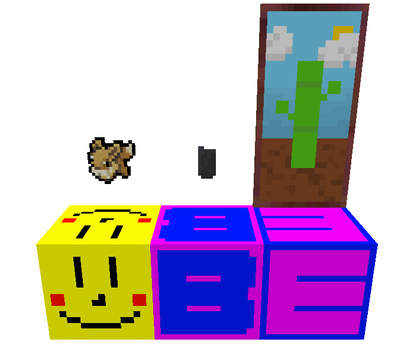
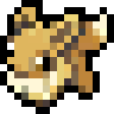
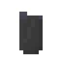

# learning-to-mod-minecraft
My first fabric mod I'd ever made. Modification of Minecraft 1.19.

---

Screenshot of my added features:

---

Feature | Image | Type | Description
------- | ----- | ---- | -----------
Happy Block |  | Block | An animated block that says 'yippee' whenever interacted with.
B |  | Block | A block that has the letter 'B' on it. It requires at least a stone pickaxe to mine and drop, and it produces experience points when mined.
E |  | Block | A block that has the letter 'E' on it. It requires at least a stone pickaxe to mine and drop, and it produces experience points when mined.
Eevee |  | Item | An item that looks like Eevee from Pokémon.
Lighter |  | Item | An lighter item that doesn't actually light anything on fire. When used, it clicks for a random number of times and fails.
Bamboo |  | Painting | A 1x2 Minecraft painting that depicts a bamboo stalk growing.
